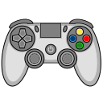

<h1 align="center">
	InputController
</h1>

<p align="center">
  Easily differentiate between a button tap, double tap, press, long press, and hold for all of your input actions in Godot.
</p>

<p align="center">
  <a href="https://godotengine.org/download/" target="_blank" style="text-decoration:none"></a>
  <a href="https://github.com/sscovil/godot-input-controller-addon/releases"  target="_blank" style="text-decoration:none"></a>
  <a href="https://github.com/sscovil/godot-input-controller-addon/" target="_blank" style="text-decoration:none"></a>
</p>

<p align="center">
  
</p>

## Table of Contents

- [Pre-Release Notice](#pre-release-notice)
- [Version](#version)
- [Installation](#installation)
- [Usage](#usage)
- [Configuration](#configuration)
- [License](#license)

## Pre-Release Notice

This add-on is currently in a pre-release state. It has been tested and is working as expected, but it has not yet been
used in a production environment. Please report any issues you encounter.

## Version

InputController **requires at least Godot 4.2**.

## Installation

Let's install InputController into your Godot project:

- Download the `.zip` or `tar.gz` file for your desired InputController version [here](https://github.com/sscovil/godot-input-controller-addon/releases).
- Extract the `addons` folder from this file.
- Move the `addons` folder to your Godot project folder.

Now, let's verify you have correctly installed InputController:

- You have this folder path `res://addons/InputController`.
- Head to `Project > Project Settings`.
- Click the `Plugins` tab.
- Tick the `enabled` button next to InputController.
- Restart Godot.

## Usage

To get started, simply add an `InputController` node to your scene tree. This node will automatically start listening
for input events and emitting a signal when it detects a tap, double tap, press, long press, or hold for any action.

Once you've added the `InputController` to your scene tree, simply connect an event handler function in your script to
the `input_detected` signal:

```gdscript
const InputType = InputController.InputType
@onready var input_controller = $InputController

func _ready():
	input_controller.connect("input_detected", _on_input_detected)

func _on_input_detected(event: InputEvent, action: String, input_type: InputType):
	match input_type:
		InputType.TAP:
			prints(action, "tapped")
		InputType.DOUBLE_TAP:
			prints(action, "double tapped")
		InputType.PRESS:
			prints(action, "pressed")
		InputType.LONG_PRESS:
			prints(action, "long pressed")
		InputType.HOLD:
			prints(action, "held")
```

```C#
	[Export]
    private InputController _controller;

    public override void _Ready()
    {
        _controller.InputDetected += OnInputDetected;
    }

    private void OnInputDetected(InputEvent inputEvent, string action, InputType inputType)
    {
        GD.Print($"{action} {inputType}");
    }
```

The signal will send the `InputEvent` that triggered the action, the name of the action that was triggered, and the type
of input that was detected. The `InputType` enum has the following values:

- `ACTIVE`: An indication that an input event has just begun.
- `TAP`: A quick press and release of a button.
- `DOUBLE_TAP`: Two quick presses and releases of a button.
- `PRESS`: A standard press of a button.
- `LONG_PRESS`: A press and slightly prolonged hold of a button.
- `HOLD`: A press and hold of a button that has exceeded the long press duration.
- `CANCEL`: An indication that an input event has been canceled.

The `InputType.ACTIVE` value is used to indicate that an input event has just begun (i.e. the action was just pressed).
The actual type of input will be determined when the button is released.

The `InputType.CANCEL` value is used to negate the first tap in a double tap sequence. The signal for the first tap
cannot be emitted until either a second tap is detected, or the double tap delay has been exceeded.

## Configuration

The following exported values can be modified in the Godot Editor Inspector, or programmatically
by directly accessing the properties of the node.

Here is an example of how you can modify the settings in a script:

```C#
	[Export]
    private InputController _controller;

    public override void _Ready()
    {
        // Input Timing
        _controller.MaxButtonTap = 0.18
        _controller.MaxDoubleTapDelay = 0.12
        _controller.MaxButtonPress = 0.45
        _controller.MaxLongPress = 0.85
        
        // Input Handlers
        _controller.UiInputs = ["ui_*", "menu_*"]
        _controller.ShortcutInputs = ["shortcut_*", "quit_game"]
        _controller.UnhandledKeyInputs = ["*_key"]
        _controller.UnhandledInputs = ["player_*_action", "player_*_move"]
        
        // Event Propagation
        _controller.SetInputAsHandled = true  // Default value
    }
```

### Input Timing Configuration

Use these settings to fine tune the timing used to differentiate between a tap, double tap, press, long press, and
hold. These are `float` values measured in seconds, so you can get very precise.

| Inspector Label      | Property Name          | Type    | Default |
|----------------------|------------------------|---------|---------|
| Max Button Tap       | `MaxButtonTap`       | `float` | `0.2`   |
| Max Double Tap Delay | `MaxDoubleTapDelay` | `float` | `0.1`   |
| Max Button Press     | `MaxButtonPress`     | `float` | `0.5`   |
| Max Long Tap         | `MaxLongPress`       | `float` | `1`     |

### Input Handlers Configuration

Use these settings to customize which event handlers are used to detect different types of actions, and which input
actions to listen for.

| Inspector Label      | Property Name          | Type            | Default    | Method                    |
|----------------------|------------------------|-----------------|------------|---------------------------|
| UI Inputs            | `UiInputs`            | `string[]` | `["ui_*"]` | [_Input(InputEvent @event)]                |
| Shortcut Inputs      | `ShortcutInputs`      | `string[]` | `[]`       | [_ShortcutInput(InputEvent @event)]  |
| Unhandled Key Inputs | `UnhandledKeyInputs` | `string[]` | `[]`       | [_UnhandledKeyInput(InputEvent @event)] |
| Unhandled Inputs     | `UnhandledInputs`     | `string[]` | `["*"]`    | [_UnhandledInput(InputEvent @event)]      |

[_Input(InputEvent @event)]: https://docs.godotengine.org/en/stable/classes/class_node.html#class-node-private-method-input
[_ShortcutInput(InputEvent @event)]: https://docs.godotengine.org/en/stable/classes/class_node.html#class-node-private-method-unhandled-shortcuts
[_UnhandledKeyInput(InputEvent @event)]: https://docs.godotengine.org/en/stable/classes/class_node.html#class-node-private-method-unhandled-key-inputs
[_UnhandledInput(InputEvent @event)]: https://docs.godotengine.org/en/stable/classes/class_node.html#class-node-private-method-unhandled-input

Each array can have zero or more strings that represent the names of the actions you want to listen for. The `*`
character is a wildcard that will match any string if used alone, or any part of a string if used in combination with
other characters.

For example:

- `["ui_*"]` will match any action that starts with `ui_`.
- `["*_key"]` will match any action that ends with `_key`.
- `["player_*_action"]` will match any action that starts with `player_` and ends with `_action`.
- `["shortcut_*", "quit_game"]` will match any action that starts with `shortcut_` or is exactly `quit_game`.
- `["*"]` will match any action.

By default, the [_Input(InputEvent @event)] method will be used to handle all actions that start with `ui_`; and [_UnhandledInput(InputEvent @event)]
will be used to handle all other actions. This may or may not have a material impact on your game, but it's good to
know if things aren't behaving as expected.

More information about how input events are processed in Godot can be found
[here](https://docs.godotengine.org/en/stable/tutorials/inputs/inputevent.html#how-does-it-work).

### Event Propagation Configuration

If set to `true` (default value), the `InputController` will consume an `InputEvent` and stop it from propagating to
other nodes by calling `GetViewport().SetInputAsHandled()`.

To allow the event to propagate after handling it, set this value to `false`. You might want to do this if you are
only using the `InputController` for logging, analytics, or some other observational behavior.

| Inspector Label      | Property Name           | Type    | Default |
|----------------------|-------------------------|---------|---------|
| Set Input as Handled | `SetInputAsHandled`  |  `bool` | `true`  |

## Troubleshooting

### Input Actions Not Being Detected

The `InputController` will only receive an input event if it has not already been handled by a child node, or a sibling
node that appears below it in the scene tree.

Try creating a new scene with only the `InputController` node and see if the input actions are detected. If they are,
then you know the actions are being handled elsewhere in your code before they reach the `InputController`.

### Input Actions Being Handled by the Wrong Handler

This is likely an issue with your [Input Handlers Configuration](#input-handlers-configuration).

When using wildcards, be aware that the order of the handlers in the list matters. The first handler that matches an
action will be the one that ends up handling it.

For example, let's say you have the following configuration:

1. **UI Inputs**: `["ui_*", "*_menu"]`
2. **Shortcut Inputs**: `["shortcut_*"]`
3. **Unhandled Key Inputs**: `["*"]`
4. **Unhandled Inputs**: `["player_*"]`

In this case, an action named `shortcut_menu` would be handled by the **UI Inputs** handler, because it matches `*_menu`
and that handler gets first pick of the actions. Likewise, no actions would make it to the **Unhandled Inputs** handler,
because the `*` wildcard was used in the **Unhandled Key Inputs** handler.

## License

This project is licensed under the terms of the [MIT license](https://github.com/sscovil/godot-input-controller-addon/blob/main/LICENSE).
